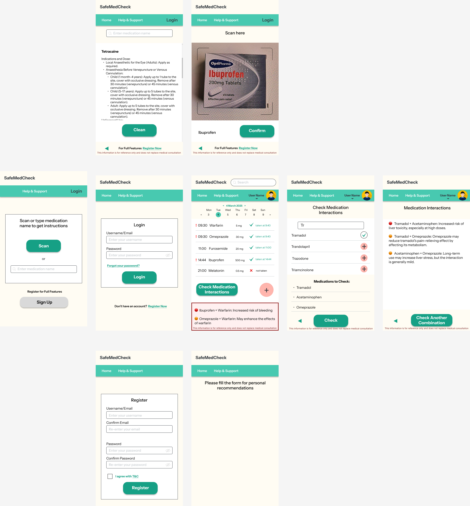
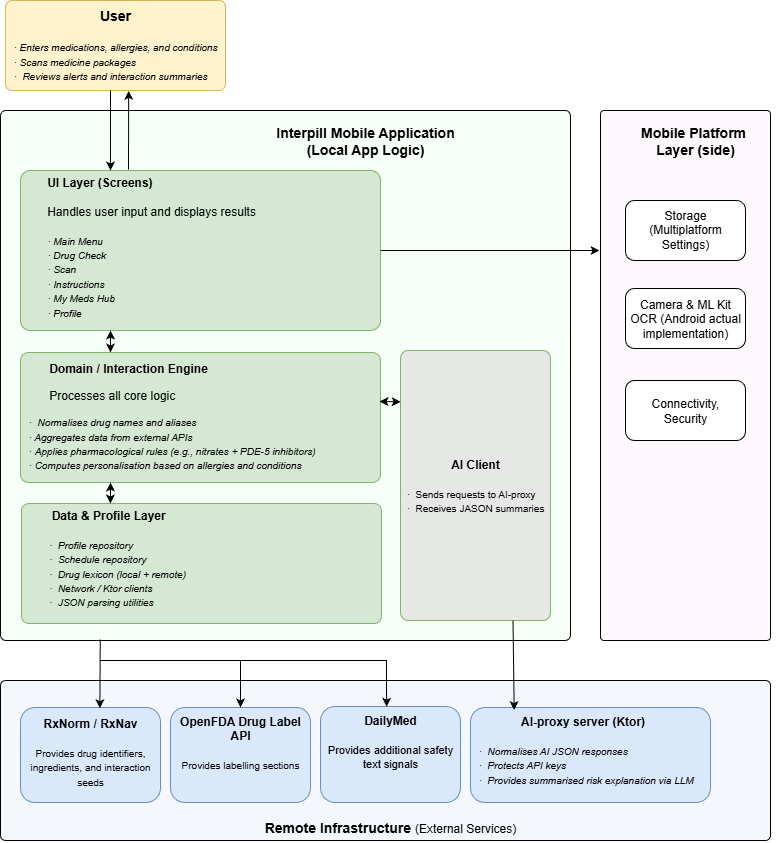
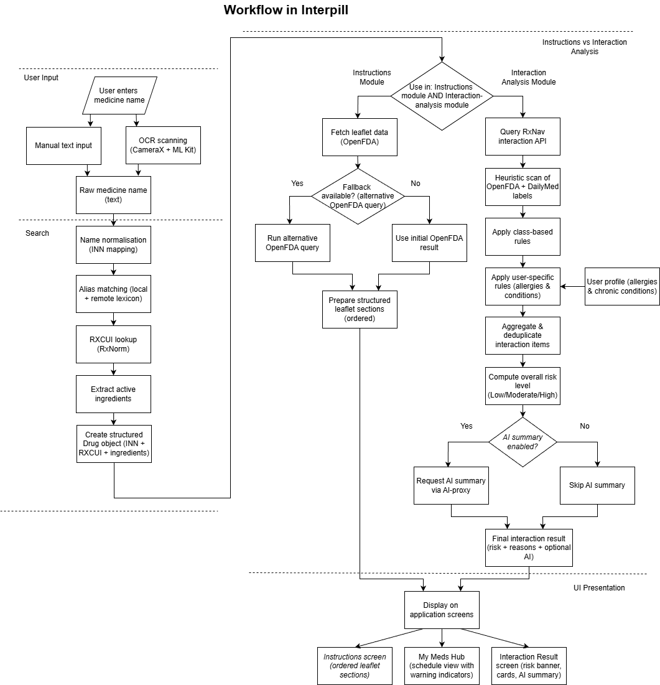
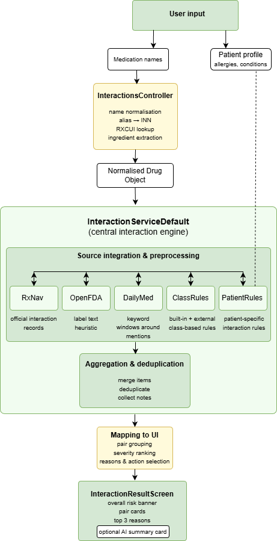
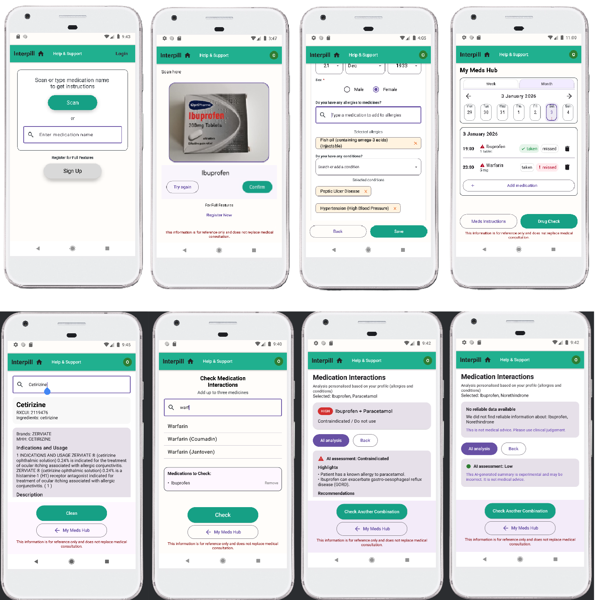
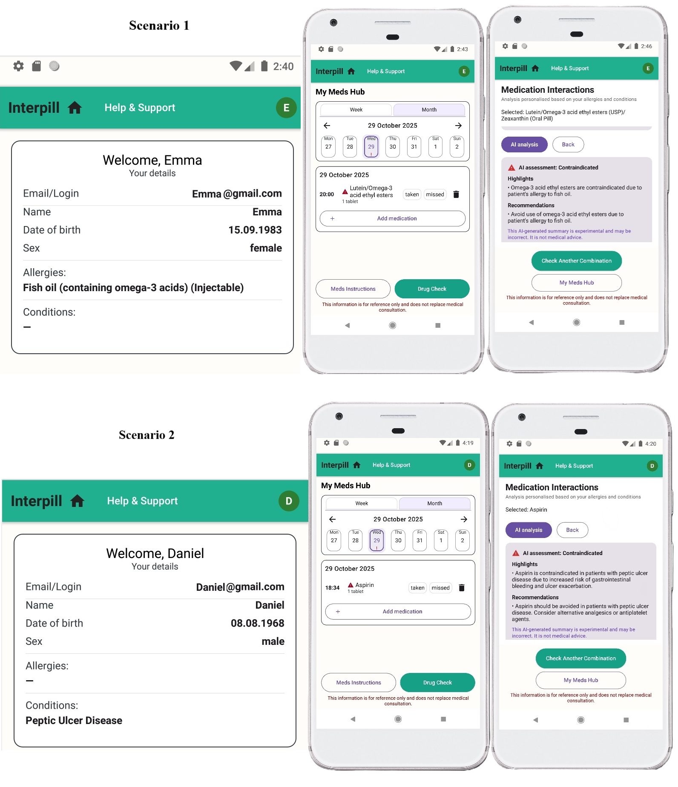
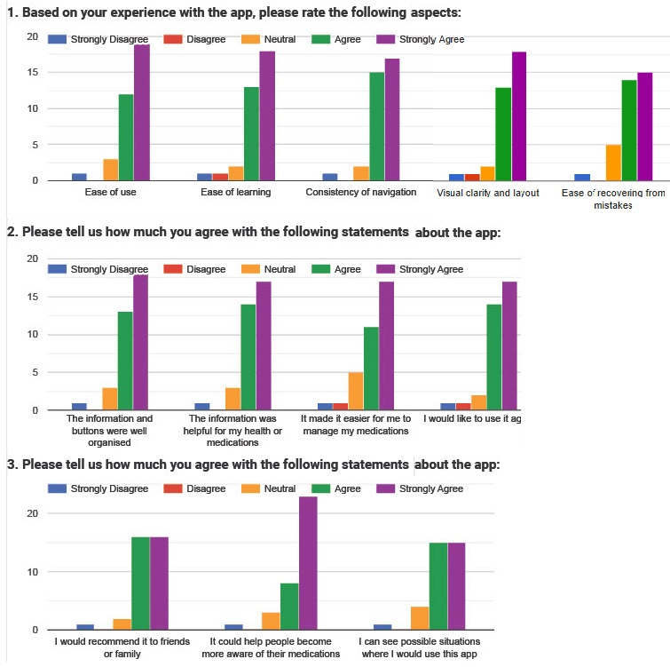

# Interpill — Personalised Drug–Drug Interaction Prototype

**Interpill** is a Kotlin Multiplatform mobile prototype designed to help users check potential interactions between medicinal products.

The application aggregates data from multiple open pharmaceutical sources (including RxNorm, OpenFDA, and DailyMed) and performs a rule-based interaction analysis. The system also considers user-specific factors such as allergies and chronic conditions stored in the user profile.

An AI module provides an additional explanatory layer that translates technical interaction results into clear user-oriented summaries.

Interpill is intended as a decision-support and awareness tool. It does not provide medical diagnosis and is not a substitute for professional medical advice.

The project includes:

- Multi-source data retrieval and validation (RxNorm, OpenFDA, DailyMed)
- Interaction analysis logic
- UX design and iterative prototyping
- Usability study (N=34, MAUQ-based survey)

**Demo video:** [Interpill Demo](https://youtu.be/krAb9nkezV8)  

**Test APK and testing scenarios:** https://olgaleobel.github.io/Interpill-App-Testing/

**Test APK and testing scenarios:** https://olgaleobel.github.io/Interpill-App-Testing/

Project Scope and Limitations

Interpill is implemented as a research prototype. The Android version contains the most complete implementation of the functionality, while the iOS and Desktop versions are partially implemented as part of the Kotlin Multiplatform architecture demonstration.

Certain aspects typical of production healthcare systems were intentionally outside the scope of this project. In particular, comprehensive cybersecurity measures, full regulatory compliance, and integration with clinical information systems were not addressed, as the primary objective of the study was the design and evaluation of a user-oriented prototype for drug–drug interaction awareness.

---

## 1. Prototype & Architecture

- **Early low-fidelity Figma prototype**

Reflected both the visual appearance of the interface and the links between key components of the application. During further development, the design underwent individual changes due to refinement of requirements and technical constraints identified at the implementation stage.

  

- **High-level architecture of the mobile application**

Illustrates the main functional layers of the mobile application, their interactions, and the boundaries between local processing and external services. The mobile application is structured into several logical layers, each responsible for a distinct aspect of the system’s functionality. This layered organisation is reflected both in the architectural model and in the package structure.

  

- **Overall workflow of the test bed**

Full end-to-end workflow of the processing pipeline illustrates the complete sequence from medicine input (typed or obtained via OCR) through name normalisation, alias resolution, RXCUI lookup, and external-source querying, to the branch between the instructions module and the interaction-analysis module, and finally to the presentation of results on the application screens. The diagram represents the high-level flow of data across the functional components described in this subsection.
  
  

- **Interaction-analysis pipeline**

The user provides two types of input: medication names and patient profile data (allergies and chronic conditions). These inputs follow separate processing paths. Medication names are passed to the InteractionsController component, while profile data are stored within the user profile and subsequently accessed by patient-specific rule sets during analysis. 

The InteractionsController component is responsible for preparing medication data for analysis. It normalises the entered names by mapping brand names and synonyms to standard International Nonproprietary Names (INNs), applies alias resolution, performs RXCUI lookup via RxNorm, and extracts the corresponding lists of active ingredients. As its output, it produces a list of normalised Drug objects, which are then passed to the central interaction engine. 

The core interaction engine, implemented as InteractionServiceDefault, acts as an aggregator of all interaction sources. At this stage, interaction data are obtained in parallel from the RxNav API, OpenFDA, DailyMed, class-based rule sets, and patient-specific rules. Each source returns a set of interaction items describing a drug pair, an estimated risk level, and a brief rationale (such as an official interaction record, a labelling excerpt, a class-based rule, or a user-related constraint). The aggregation stage performs merging and deduplication of overlapping interaction signals originating from different sources. Interaction items referring to the same drug pair are combined, and a consolidated set of notes is formed. These notes may include, for example, indications of duplicate active ingredients, applied heuristic rules, or patient-specific risk factors.

  
  

---

## 2. Key User Screens & Scenarios

- **Combined user screens** (Main screen, OCR-based recognition, User Profile, Medication Schedule etc.)
- 
Demonstrates the core user interface elements and main user flows.

  

- **Interaction result scenarios** (risk indicators + AI summary)

  **Scenario 1** illustrates how recorded user allergies are incorporated into the interaction analysis workflow. The screenshots show a user profile containing documented allergy information and a scheduled medication entry in the My Meds Hub. When the medication is analysed, the system takes the allergy data into account, resulting in a contraindication warning displayed on the interaction results screen.

  **Scenario 2** demonstrates how recorded chronic conditions affect the outcome of interaction analysis. The screenshots show a user profile with a documented chronic condition and the subsequent analysis of a selected medication. The presence of the condition is reflected in the interaction results, leading to a contraindication warning and condition-specific explanatory text.
  
  

*This image shows example scenarios of personalised interaction analysis and risk visualisation.*

---

## 3. Usability Study & Findings

- **Bar charts from Google Forms**

Illustrate quantitative feedback on Ease of Use, Interface & Satisfaction, and Usefulness, collected from 34 participants using the MAUQ-based survey.
  

---

## 4. Supporting Repositories

- **AI proxy service** (request routing and key isolation)  
  [https://github.com/olgaleobel/interpill-ai-proxy](https://github.com/olgaleobel/interpill-ai-proxy)  

- **Open data alias mapping for drug name normalisation**  
  [https://github.com/olgaleobel/interpill-open-data/blob/main/assets/aliases_extra.json](https://github.com/olgaleobel/interpill-open-data/blob/main/assets/aliases_extra.json)  

- **Rule-based interaction logic & class-level safety rules (public subset)**  
  [https://github.com/olgaleobel/interpill-open-data/blob/main/assets/class_rules.json](https://github.com/olgaleobel/interpill-open-data/blob/main/assets/class_rules.json)  

---

## 5. Code Excerpts

Selected fragments illustrating the implementation style and key components of the interaction-analysis pipeline.

- **Core interaction aggregation**
This fragment presents the core logic of the interaction analysis. The service receives a normalised list of medicinal products and, optionally, the patient context. A multi-layer aggregation of results from several sources is then performed: official interaction data (RxNav), fallback sources (OpenFDA and DailyMed), as well as rules based on pharmacological classes and personal factors. The implementation is designed in a defensive manner: the failure of a single layer does not block the final outcome. At the output, a unified list of findings (InteractionItem) is generated, deduplication by the medicine pair and the source is carried out, and explanatory notes are formed (for example, on the possible duplication of active ingredients).
  
  [`interaction_service_excerpt.kt`](code-excerpts/interaction_service_excerpt.kt)

- **Input normalisation & RxNorm enrichment**
This fragment illustrates the transition from user input (string medication names) to structures suitable for calculating interactions. For each name, a “display base” is extracted, after which normalisation for the RxNorm query is performed (focusing on INN and removing noise). After obtaining the RXCUI, the active ingredients are retrieved; the assembled list of Drug is then passed to the InteractionService, which performs the aggregated analysis.
  
  [`interactions_controller_excerpt.kt`](code-excerpts/interactions_controller_excerpt.kt)

- **Result data structures**
The fragment records the internal data structures used for unifying the result across sources: a single severity enum (InteractionSeverity), the result element InteractionItem (the pair of medicinal products, severity, description, source), and the aggregated container InteractionResult (the list of findings and the list of notes).
  
  [`interaction_models_excerpt.kt`](code-excerpts/interaction_models_excerpt.kt)

- **Built-in class rules**
This fragment presents a minimal built-in rule set for clinically important drug-class interactions. The rules are embedded directly in the client to ensure that critical warnings can still be generated when external rule definitions (for example, a remote JSON rule set) are unavailable. Each medicinal product is matched against a small set of class keywords using both the user-facing query string and the resolved active ingredients. The evaluator then examines all pairs of medicinal products and emits a high-severity InteractionItem when a known clinically critical class combination is detected.
  
  [`built_in_class_rules_excerpt.kt`](code-excerpts/built_in_class_rules_excerpt.kt)

- **User-aware rules**
This fragment implements a user-aware rule layer that supplements the interaction analysis using profile data (allergies, chronic conditions, and pregnancy/breastfeeding status). The logic produces “self-pair” findings (a == b), enabling the presentation layer to indicate risks associated with a specific medicinal product even when the issue does not constitute a drug–drug interaction but represents a patient–drug contraindication or caution. The evaluator performs string matching over normalised tokens derived from the medicine name and active ingredients and generates warnings with appropriate severity levels (for example, HIGH for allergy matches, MODERATE for diabetes-related dysglycaemia risk associated with fluoroquinolones, and LOW for general applicability notes).  
  [`patient_rules_excerpt.kt`](code-excerpts/patient_rules_excerpt.kt)

- **Drug name normalisation**
This listing presents the normalisation logic used to process user-entered medicine names into a UK-oriented INN representation (NHS/BNF style). The normaliser removes dosage- and form-related elements (for example, strengths, pack sizes, and release markers), preserves clinically significant terms (in particular, nitrate-related patterns), and applies alias canonicalisation (brand names and US variants mapped to UK INN). The implementation also supports an external, editable alias layer (for example, read from JSON), which has precedence over the built-in mapping. The resulting normalised names are used for search queries, RXCUI resolution, and user-facing suggestions.
  
  [`name_normalizer_excerpt.kt`](code-excerpts/name_normalizer_excerpt.kt)

- **RxNorm enrichment**
This fragment illustrates how Interpill resolves a normalised medicine name (UK-oriented INN) to an RxNorm identifier (RXCUI) and subsequently extracts active ingredients at the IN (Ingredient) level. The RXCUI lookup follows a staged fallback procedure (selection of the preferred concept from drugs.json, direct lookup via rxcui.json, and approximate matching via approximateTerm). Ingredient extraction uses allrelated.json and filters for IN concepts, which are used in the subsequent interaction checks and rule-based logic.

  [`rxnorm_api_excerpt.kt`](code-excerpts/rxnorm_api_excerpt.kt)

- **OpenFDA label matching**
This fragment illustrates the procedure used to match a medicine name (typically a normalised INN) to an OpenFDA drug label record. The lookup is performed through staged queries: exact matching against generic or substance names, wildcard matching, brand-name queries, and a full-text fallback. After a record is retrieved, the label is converted into a unified DrugLabel structure containing an ordered map of sections (for example, “Indications and Usage”, “Warnings and Precautions”, and “Drug Interactions”). The ordering of sections is applied consistently in the presentation layer.
  
  [`openfda_api_excerpt.kt`](code-excerpts/openfda_api_excerpt.kt)

*Interpill demonstrates end-to-end design, implementation, and evaluation of a personalised drug interaction mobile application.*
